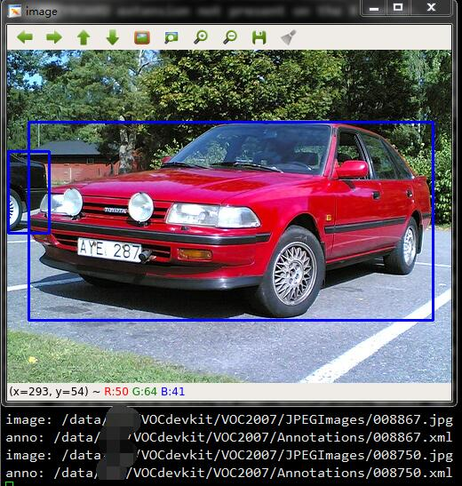
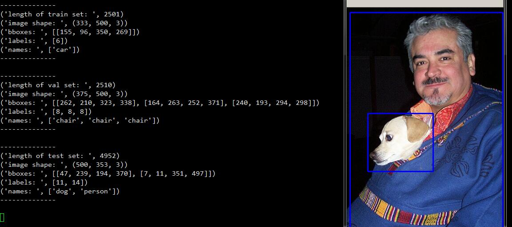

# voc_visualizer
Visualizer of PASCAL Visual Object Classes dataset.

# Usage of visualize_voc.py
```python
python visualize_voc.py /data/VOCdevkit/VOC2007/
```



# Usage of voc_data_provider.py
```python
python voc_data_provider.py /data/VOCdevkit/VOC2007/
```

